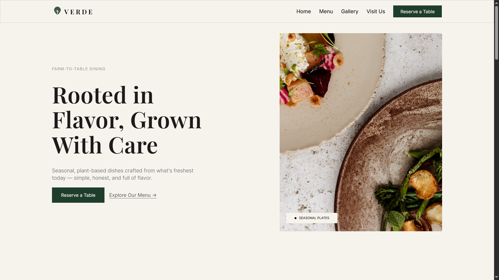

# VERDE — Plant-Based Restaurant Website

A responsive restaurant website built for **VERDE**, a fictional farm-to-table, plant-based dining concept. Designed in Figma and built from scratch using vanilla HTML, CSS, and JavaScript — no frameworks or libraries.

**Live site:** https://musawir-ali.github.io/VERDE-Restaurant/

## Preview

## Overview

VERDE is a portfolio project showcasing a full restaurant website build, including:

- Responsive hero section with layered imagery
- Signature dishes showcase with hover interactions
- Horizontally scrollable gallery with custom navigation controls
- Menu preview section
- Reservation form with client-side validation and a dynamic confirmation state
- Sticky navigation and consistent design system across all sections

## Built With

- **HTML5** — semantic markup
- **CSS3** — Flexbox, Grid, custom properties, responsive layout
- **JavaScript (Vanilla)** — DOM manipulation, event handling, form logic
- **Google Fonts** — Playfair Display (headings), Inter (body text)
- **Lucide Icons** — inline SVG icon set

## Project Structure

VERDE-Restaurant/
├── index.html
├── style.css
├── script.js
└── images/

## Design

Design created in Figma, based on a farm-to-table restaurant concept with a warm, editorial aesthetic — earthy greens, cream tones, and elegant serif typography paired with a clean sans-serif for readability.

## Author

**Musawir Ali**
Front-end web developer — [GitHub](https://github.com/Musawir-Ali)
